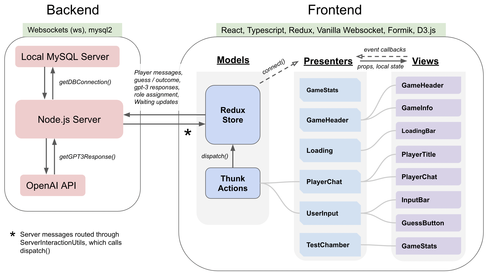
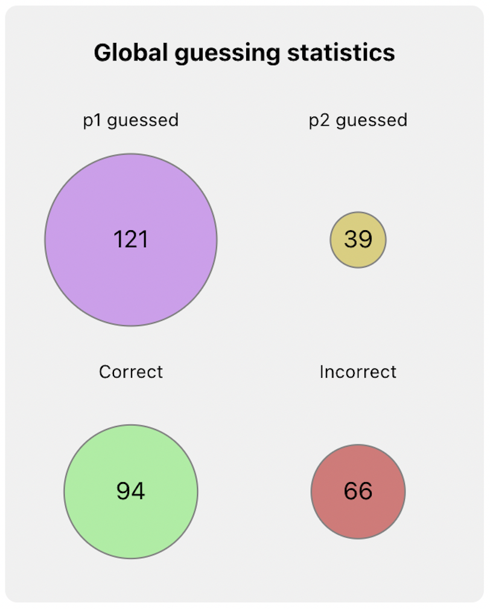

# Startup

### MySQL local database setup

1. Download MySQL and open up a new terminal instance
2. Connect to the root user with `mysql -u root -p` and input your password if prompted (if you're on osx and run into "command not found: mysql", you may have have to edit your path with `export PATH=${PATH}:/usr/local/mysql/bin`)
3. Run the following commands from the mysql prompt as the root user:
```
CREATE USER 'ttcserver'@'localhost';
CREATE DATABASE ttcdb;
GRANT ALL PRIVILEGES ON ttcdb.* TO 'ttcserver'@'localhost';
```
These will create a new user ttcserver on localhost, a new database ttcdb, and then give ttcserver the abillity to write and read to ttcdb. Run `quit` to close the mysql prompt

(To clean up after grading run `DROP DATABASE ttcdb;` and `DROP USER 'ttcserver'@'localhost';` from the root user)

### Start server and clients

1. Open three seperate terminal instances in the turing-test-chamber directory
2. Run `npm install`
3. In one of the terminals, run `npm run server`
4. In the other two terminals run `npm run dev1` and `npm run dev2` respectively.
5. Open up two windows at http://localhost:3000/ and http://localhost:3001/ to see both client instances
6. To execute tests, run `npm test` from the turing-test-chamber directory


# Architecture Graphic




# Implementation Points

- [x] Regex (3) (e.g. in [APICalls](./server/APICalls.js))
- [x] Promise.all() (5) (createNewGPT3Prompt in [serverUtils](./server/serverUtils.js))
- [x] Dark mode (5) ([GameHeaderPresenter.tsx](./client/presenter/GameHeaderPresenter.tsx))
- [x] Animations with react-spring and vanilla CSS (5) (e.g. in [PlayerChatPresenter](./client/presenter/PlayerChatPresenter.tsx))
- [x] Use debug for all logging (3)
- [x] D3.js (5) ([VisualizationUtils](./client/utils/VisualizationUtils.tsx))
- [x] Formik (3) ([GuesserInputBarView](./client/view/GuesserInputBarView.tsx))
- [x] Redux-thunk (5) ([actions](./client/model/actions.tsx))
- [x] moment.js (3) (e.g. in [dbUtils](./server/dbUtils.js))
- [x] No big unecessary DOM updates (3)
- [x] 4-6 tested components depending on how you count <br/>
(PlayerChatView, dark mode toggle, game info toggle, game info close button, submit button + text input, guess button) (16 - 24) ([tests](./client/tests/))
- [x] automated pre-commit testing with git hooks (5)
- [x] Re-using UI components (5) (e.g. same PlayerChatView for both p1 and p2, both clients use all the same components)
- [x] Typescript (15)
- [x] Run own MySQL database (10) (connection in [dbUtils](./server/dbUtils.js))
- [x] Websocket multiplayer (10) ([server](./server/server.js))
- [x] Dynamic loading status through websockets (10) ([LoadingPresenter](./client/presenter/LoadingPresenter.tsx))
- [x] Good error codes (5) (e.g. in [server](./server/server.js))

<!--- Total max: 124 -->

# Group Cooperation

Kai Nylund is the only group member

### Stats after testing


